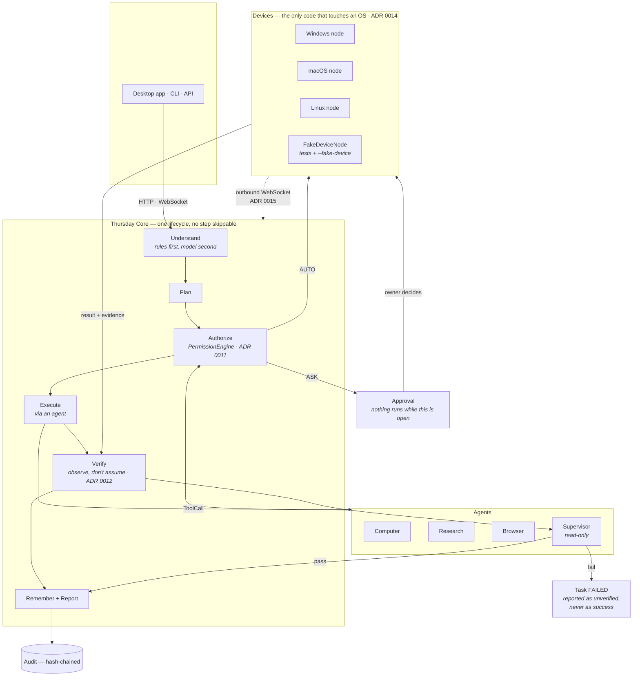

# Thursday

> **One assistant, many capabilities.**
> A personal AI operating system — not a chatbot, and not a collection of agents wearing a
> trench coat.

The owner talks to exactly one identity: **Thursday**. Everything behind it — specialist
agents, tools, models, devices — is machinery Thursday drives on their behalf.

```
USER → THURSDAY → Understand → Plan → Delegate → Act → Verify → Remember → Report
```

---

## Status

**Phase 1 is implemented and runnable**: the vertical slice from
[docs/15-vertical-slice.md](docs/15-vertical-slice.md) works end to end, with 421 tests that
need no database, no network and no model credentials.

```
$ python -m apps.cli --device-name Office-PC

you> Thursday เปิด chrome
Thursday> เปิด chrome เรียบร้อย (ยืนยันแล้ว)
          [SUCCESS · confidence 1.00]

you> Thursday เปิด xcalc
Thursday> ผมทำสิ่งนี้ไม่ได้ — FileNotFoundError: no executable found for 'xcalc' on this machine
          [WARNING · confidence 1.00 · unverified]
```

That second answer is the point. Thursday does not say a thing worked because a command was
sent; it says what it *observed*.

---

## Quick start

```bash
uv venv && source .venv/bin/activate      # or: python -m venv .venv
uv pip install -e ".[dev]"
alembic upgrade head                      # SQLite by default; no server needed

python -m apps.cli                        # embedded core + local node, one command
```

Three-process setup (how it runs for real):

```bash
# 1. One enrolment token, shared by the core and every node (ADR 0013).
#    The core refuses an unsigned or wrongly-signed HELLO in every environment,
#    so this is not optional and there is no development bypass.
export THURSDAY_SECRET_DEVICE_ENROLLMENT_SECRET=$(python -c "import secrets;print(secrets.token_urlsafe(32))")

python -m apps.server                                  # core API on :8000
python -m apps.node --name Office-PC --allow-root ~    # one per machine
python -m apps.cli --remote                            # or the desktop app

cd apps/desktop && npm install && npm run tauri dev    # the window
```

Check a node from the machine it runs on — this listens on loopback and executes nothing,
so it still answers when the node cannot reach the core:

```bash
curl -s localhost:8765/health | jq        # connected_to_core, last_error, allowed_roots
curl -s localhost:8765/capabilities | jq  # what this node will actually do
```

Then send the command:

```bash
curl -s localhost:8000/api/v1/conversations \
  -H 'content-type: application/json' \
  -d '{"text": "Thursday เปิด Chrome"}' | jq

# {"text": "เปิด chrome เรียบร้อย (ยืนยันแล้ว)", "status": "COMPLETED", "verified": true, ...}
```

`verified: true` is the part that matters. It means the node looked for the process after
launching it and found it — not that the launch command returned without an error.

Reconstruct any single turn from the trail:

```bash
curl -s "localhost:8000/api/v1/audit?trace_id=$TRACE" | jq '.entries[] | {tool, action, result}'
```

With Postgres, Redis and a separate worker:

```bash
docker compose up -d          # postgres+pgvector, redis, api, worker
./scripts/dev.sh              # or run the pieces locally
```

Nothing above reaches for the cloud. The default model backend is a deterministic offline
tier; point `THURSDAY_LLM_BACKEND` at `ollama` or `anthropic` when you want reasoning.
See [.env.example](.env.example).

### CLI commands

`/devices` `/approvals` `/approve <n> [always]` `/reject <n>` `/tasks` `/memory <query>`
`/audit` `/undo` `/world` `/health` `/stop` `/help`

---

## The nine rules the code enforces

These are the design, and they are tested rather than documented and hoped for.

Paths below are relative to `packages/<name>/thursday_<name>/`.

| # | Rule | Where it lives |
|---|---|---|
| 1 | **Verify before reporting success.** Dispatch is not success. | `devices/node/executor.py`, `core/supervisor.py`, `core/tasks.py::complete` |
| 2 | **Least privilege, explicit permission.** Every action passes the engine; the BLOCK set has no override path — not by config, not by grant, not by an agent's own reasoning. | `security/permissions.py`, `security/policy.py` |
| 3 | **Secrets never enter a prompt, a note, a log or a vector store.** | `security/vault.py`, `security/redaction.py` |
| 4 | **Privacy decides where inference runs.** `SECRET` never leaves the machine, and an agent that could reach the cloud is excluded rather than penalised. | `security/privacy.py`, `core/model_router.py`, `agents/registry.py` |
| 5 | **Memory is curated, not a transcript.** Conflicts are recorded, never merged, and an agent cannot write the owner's preferences. | `memory/manager.py` |
| 6 | **Everything is audited and, where possible, reversible.** | `security/audit.py`, `core/undo.py` |
| 7 | **Providers are swappable.** Every port has a real adapter and an offline one. | `shared/interfaces.py`, `core/container.py` |
| 8 | **Thursday proposes; the owner decides.** Learned routines arrive disabled; risky skills cannot self-activate. | `automation/routines.py`, `automation/skills/registry.py` |
| 9 | **Untrusted content is data, never instruction.** A page or a file cannot widen what Thursday may do. | `agents/browser.py`, [ADR 0010](docs/architecture/decisions/0010-untrusted-content-is-data.md) |

Rule 1, concretely:

```python
# packages/core/thursday_core/tasks.py
if not verification.passed:
    raise ThursdayError("refusing to complete a task whose verification did not pass")
```

---

## Architecture at a glance



The one path worth tracing: **nothing reaches a device without passing Authorize, and
nothing completes without passing Verify.** Both are single choke points rather than
conventions, so neither can be forgotten by a new caller.

Full design in [`docs/`](docs/) — the fifteen deliverables, written before the code, plus
the [V2 review](docs/architecture/00-v2-review.md) and nineteen
[architecture decisions](docs/architecture/decisions/) recording what was chosen and what
each choice cost:

| | | | |
|---|---|---|---|
| [Architecture](docs/01-architecture.md) | [Stack](docs/02-tech-stack.md) | [Repo layout](docs/03-repository-structure.md) | [Database](docs/04-database-schema.md) |
| [Interfaces](docs/05-core-interfaces.md) | [Agents](docs/06-agent-architecture.md) | [Memory](docs/07-memory-architecture.md) | [Permissions](docs/08-permission-model.md) |
| [Device protocol](docs/09-device-protocol.md) | [Events](docs/10-event-architecture.md) | [API](docs/11-api-spec.md) | [MVP scope](docs/12-mvp-scope.md) |
| [Roadmap](docs/13-roadmap.md) | [Threat model](docs/14-threat-model.md) | [Vertical slice](docs/15-vertical-slice.md) | [Persona](docs/16-persona.md) |
| [Voice](docs/17-voice.md) | | | |

---

## What is built, and what is not

**Built and working**

- Full request lifecycle in one place (`core/engine.py`), so no step can be skipped
- Permission engine, action policy, scoped expiring grants, approval flow, hash-chained audit
- Device node protocol (TNP/1) with Windows, macOS and Linux adapters, a path jail, and
  ACT→VERIFY on every action
- Task state machine with budgets, bounded informed retries, and a queue
- Layered memory with an explicit write policy, conflict recording and decay — and
  remembered instructions that are *applied* to later work rather than only recalled,
  with "forget about X" and "don't remember this" as first-class commands
- Obsidian vault that *refuses* credential material rather than redacting it
- Agent orchestrator, capability-based selection, and a read-only Supervisor
- Dynamic agents with intersected permissions, depth and count caps, destroyed with the task
- Automation engine, proactivity gate with rate limits, routine learning that **proposes**
- Skills: capture → sandbox test → approval → activate → rollback, with risky steps gated
- Spatial memory that answers as a *sighting*, and gesture mode that expires when idle
- Model router with tiers, cost/privacy routing and a local fallback
- Realtime voice: wake word → VAD → STT → core → verification → TTS, with a
  state machine, working barge-in, per-mode prosody, audio routing and provider
  fallback that survives a network failure mid-utterance
- Background worker: memory decay, health, device liveness, approval expiry
- 64 REST operations, two WebSockets, 29-table schema with working migrations and seeds

**Designed, ported, not yet implemented** — every one has an interface and a Phase in
[the roadmap](docs/13-roadmap.md):

- SQL-backed repositories behind the memory/task/audit ports (they run in-process today;
  the schema and migrations are in place). This is the largest gap.
- Redis event bus and worker queue (the in-process bus implements the same port)
- Camera capture, OCR and object detection — the *interpretation* layers (spatial memory,
  gesture classification from landmarks) are built and tested; the model that produces the
  landmarks arrives in Phase 3
- Real microphone and speaker capture. The voice loop, its state machine, barge-in,
  routing and fallback are built and tested end to end against synthetic audio; what is
  missing is the hardware layer (`sounddevice`) and a cloud provider at the head of the
  chain. faster-whisper and Piper adapters are written but unexercised without model files
- Mobile client (scaffold in `apps/mobile`). The desktop app is built — conversation,
  approvals, tasks, devices, memory and permissions — but has no voice capture and no
  embedded device node yet
- Ed25519 device signature verification is scaffolded in the protocol and enforced only in
  `production`; the keypair generation and pairing flow land in Phase 2

Nothing is faked at a layer where faking would hide a design problem. The permission checks,
the verification loop, the audit chain and the device round-trip are all real.

---

## Development

```bash
./scripts/check.sh           # everything CI runs: lint, format, types, tests, migrations
pytest                       # 421 tests, no infrastructure
ruff check . && ruff format .
mypy packages services
alembic upgrade head && alembic revision --autogenerate -m "what changed"
python -m database.seeds     # idempotent: one owner, six agents, the tool catalogue
```

`thursday_devices.fake` ships a `FakeDeviceNode` whose `fail_launch=True` mode makes a
command appear to succeed while nothing actually starts — the case rule 1 exists for. It is
a shipped artifact rather than a fixture, because the CLI's `--fake-device` mode and anyone
extending the node protocol need the same misbehaving node the tests use.

## Layout

```
apps/        server · node · cli · worker · desktop (Tauri) · mobile (planned)
packages/    shared · core · agents · tools · memory · devices · security
             voice · vision · automation · models
services/    api · realtime · worker
database/    migrations · seeds
docker/      api and node images; docker-compose.yml at the root
docs/        the fifteen design deliverables + architecture/decisions (ADRs)
tests/       unit · integration · e2e
scripts/     dev.sh · check.sh · check_no_secrets.py
```

## Licence

MIT.
