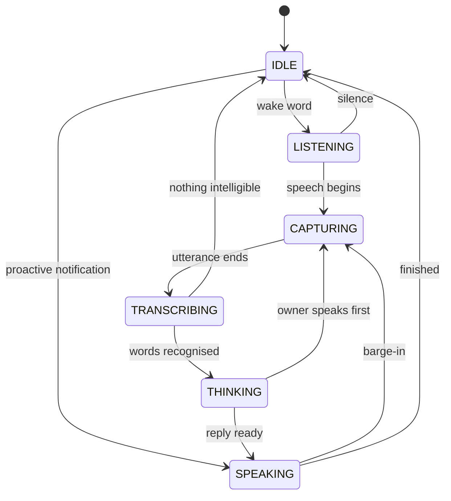

# 17. Voice (V4)

    wake word → microphone → VAD → STT → Thursday Core → verification → TTS → speaker

One loop, one state machine, one identity. The owner says "Thursday เปิด Notepad" and hears
"เปิด Notepad แล้ว" — but only once a node has looked and found the process running.

## The state machine



`LISTENING` and `CAPTURING` are the only states in which the microphone is open, and
`machine.listening` is derived from exactly that set — so the recording indicator a UI draws
is the same fact the loop acts on. `IDLE → SPEAKING` exists for proactive speech; it opens
the speaker and never the microphone, so it takes nothing away from the guarantee.

Illegal transitions raise. `reset()` is the one unconditional path, because it is what
"Thursday หยุด" runs (§69) — a stop the state machine could refuse would not be a stop.

## Barge-in

An assistant you cannot interrupt is one you end up talking over and then repeating
yourself to. Interruption does four things in order:

1. stop synthesis now — before the next chunk plays, not after the sentence finishes;
2. keep the conversation context, because "no, the other one" only means something in the
   light of what was just said;
3. reopen the microphone;
4. hand the new utterance to the core as an ordinary turn.

`BargeInController` owns the synthesis task, which is the only way the guarantee is real:
an utterance nobody holds a handle to is an utterance nobody can stop. It also records how
much the owner actually *heard*, which differs from what was queued by however much audio
was buffered.

Providers stream by sentence so there is a seam to cut on. `PiperTTS.stop()` kills the
renderer rather than letting it finish.

## Providers

| Port | Methods | Local | Cloud |
|---|---|---|---|
| `STTProvider` | `transcribe`, `stream_transcribe` | faster-whisper, text stub | (chain slot) |
| `TTSProvider` | `synthesize`, `stream_synthesize`, `stop` | Piper, text stub | (chain slot) |
| `WakeWordProvider` | `start`, `stop`, `detect` | keyword, openWakeWord | — |

Each is wrapped in a chain that falls back **inside one utterance**, so a dropped
connection costs latency rather than the turn (ADR 0017). With `voice_local_only` — the
default — a non-local provider is skipped entirely rather than tried: a request that fails
after the audio has left is not a refusal.

## Voice profile

One voice, six modes. The modes are how a spoken reply carries what formatting carries in
writing: "Done" and "Done, but I could not verify it" must not sound the same.

| Mode | Delivery |
|---|---|
| `NORMAL` | composed, medium pace |
| `THINKING` | slower, quieter — signals "not finished" |
| `SUCCESS` | brief, slightly lifted |
| `WARNING` | firmer, marginally louder, never alarmed |
| `URGENT` | clipped and faster |
| `QUIET` | terse and low — someone else is in the room (§43) |

## Routing

`AudioRouter` decides where to speak. Order of precedence: an explicit device for this
reply, then the owner's standing preference, then a private endpoint when the reply is
`QUIET`, then the device they last spoke from, then follow-me, then the default.

Follow-me is **off** by default. Output moving on its own is a surprise, and a surprise
involving audio in a house with other people in it is the kind that ends with the feature
turned off.

## Endpoints

```
GET  /api/v1/voice             state, listening, speaking, providers, audio devices
POST /api/v1/voice/interrupt   "Thursday หยุด" — plain, no model in the path
POST /api/v1/voice/output      ?device_id=… &follow_me=…
```

## Testing it without hardware

`thursday_voice.fake` ships a microphone, a speaker, scripted and failing providers, and
`synthetic_speech()` — a waveform with real energy in the right places, so the VAD and the
segmenter are exercised rather than bypassed. The V4 acceptance test runs the whole path
against the real core and a `FakeDeviceNode`; only the microphone and speaker are
imaginary.

## Not built yet

Real microphone and speaker capture (`sounddevice` is an extra; the ports are ready), a
cloud STT/TTS adapter to sit at the head of the chain, and openWakeWord on raw audio. The
shipped `KeywordWakeWord` matches on a transcript, which is enough to prove the gating but
is not a wake-word engine.
